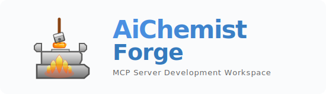

# 🧪 AiChemist Forge



**Unified MCP Server Development Workspace**

[](https://modelcontextprotocol.io)
[](https://python.org)
[](https://rust-lang.org)
[](https://typescriptlang.org)
[](https://paypal.me/safeappealnavigator)

A unified workspace for developing Model Context Protocol (MCP) servers with
organized tooling for AI development workflows.

This project provides high-performance MCP servers in Python, Rust, and
TypeScript, each optimized for different use cases.

## 🏗️ Architecture

This workspace provides a clean, unified approach to MCP server development with
separate implementations for different runtime environments:

- **Python Server** (`ToolRack/Python/`) - Comprehensive MCP server with
  filesystem, reasoning, and analysis tools
- **Rust Server** (`ToolRack/Rust/`) - High-performance filesystem operations
  with async I/O
- **TypeScript Server** (`ToolRack/TypeScript/`) - Web search, deep research,
  and Windows CLI tools
- **Planning & Documentation** (`Plans/`, `Compendium/`) - Architecture plans
  and guides

## 🚀 Quick Start

### Python Unified MCP Server

```bash
cd ToolRack/Python
uv sync --all-groups
uv run unified-mcp-server
```

**Features:**

- Filesystem tools (file_tree, codebase_ingest)
- Reasoning tools (decompose_and_think, analyze_dependencies)
- FastMCP-based with auto-discovery
- Lifecycle management, metrics, and caching

### Rust Filesystem MCP Server

```bash
cd ToolRack/Rust
cargo build --release
start_mcp_server.bat  # Windows
# Or: ./target/release/aichemistforge-mcp-server.exe
```

**Features:**

- High-performance async filesystem operations
- Composite tool architecture with operation modes
- Two-tier blocklist security system
- Standalone binary (no runtime dependencies)

### TypeScript MCP Server

**⚠️ Prerequisites:** To use web search features, you need API keys:

- **Brave Search API Key**: Get from
  [Brave Search API](https://brave.com/search/api/)
- **Perplexity API Key**: Get from [Perplexity AI](https://www.perplexity.ai/)
  (optional, for deep research)

**Setup:**

1. Create a `.env` file in `ToolRack/TypeScript/` directory:

   ```env
   BRAVE_API_KEY=YOUR_BRAVE_API_KEY_HERE
   PERPLEXITY_API_KEY=YOUR_PERPLEXITY_API_KEY_HERE
   ```

2. Install and build:
   ```bash
   cd ToolRack/TypeScript
   npm install
   npm run build
   npm start
   ```

**Features:**

- Brave Search integration (web, code, multi-link) - **Requires BRAVE_API_KEY**
- Perplexity Deep Research - **Requires PERPLEXITY_API_KEY**
- Windows CLI execution tools (no API key required)
- Semantic caching for faster searches

## 📁 Workspace Structure

```
AiChemistForge/
├── ToolRack/                    # Production MCP servers
│   ├── Python/                  # Unified Python MCP server
│   │   ├── src/unified_mcp_server/  # Server implementation
│   │   ├── pyproject.toml       # Python dependencies & config
│   │   └── README.md            # Python server documentation
│   ├── Rust/                    # Rust filesystem MCP server
│   │   ├── src/                 # Rust source code
│   │   ├── Cargo.toml           # Rust dependencies
│   │   └── README.md            # Rust server documentation
│   └── TypeScript/              # TypeScript MCP server
│       ├── src/                 # TypeScript source code
│       ├── package.json         # Node.js dependencies
│       └── README.md            # TypeScript server documentation
├── Plans/                       # Architecture & implementation plans
│   └── Python/                  # Python server planning docs
├── Compendium/                  # Documentation & guides
├── .cursor/                     # Workspace documentation & rules
└── README.md                    # This file
```

## 🛠️ Available Tools

### Python Server Tools

#### Filesystem Tools

- **`file_tree`**: Generate comprehensive file tree structures with LLM
  optimization, token counting, complexity analysis
- **`codebase_ingest`**: Process entire codebases for LLM context preparation
  with intelligent chunking

#### Reasoning Tools

- **`decompose_and_think`**: Decompose complex problems with sequential
  thinking, dependency analysis, and reflection
- **`analyze_dependencies`**: Analyze component dependencies, detect circular
  dependencies, find critical paths

**Server Features:**

- Auto-discovery tool registration
- Lifecycle management with startup/shutdown hooks
- Metrics collection and request tracing
- Middleware support (rate limiting, timing)
- LRU caching with TTL

### Rust Server Tools

#### Composite Operation Tools

- **`single_file_operations`**: Read, write, edit, get info, head, tail, read
  lines, read media files
- **`multiple_file_operations`**: Batch read, copy, move, delete operations
- **`directory_operations`**: Create, list, tree, calculate size, find empty
  directories
- **`search_and_analysis`**: Search files, search content, find duplicate files
- **`file_management`**: Zip, unzip, move, copy, delete operations

#### Operation Mode Management

- **`start_operation_mode`**: Activate specific operation modes
- **`complete_current_mode`**: Complete current mode and return to default
- **`list_available_modes`**: List all available operation modes
- **`get_current_mode_status`**: Get status and workflow history

**Server Features:**

- Two-tier blocklist security system
- Dynamic operation mode system
- Workflow tracking and history
- Standalone binary (no runtime dependencies)
- High-performance async I/O with Tokio

### TypeScript Server Tools

#### Brave Search Tools

- **`brave_web_search`**: General web searches with pagination (max 20 results)
- **`brave_code_search`**: Developer-focused searches (Stack Overflow, GitHub,
  MDN)
- **`multi_link_search`**: Sequential searches for multiple queries (up to 10
  queries)

#### Perplexity Deep Research

- **`perplexity_deep_research`**: Comprehensive deep research with citations
  (30-90 seconds per query)

#### Windows CLI Tools

- **`execute_command`**: Safe command execution (PowerShell, CMD, Git Bash)
- **`get_command_history`**: Retrieve command execution history
- **`get_current_directory`**: Get comprehensive directory information
- **`change_directory`**: Intelligently change working directory
- **`find_workspace`**: Find and analyze workspace information

**Server Features:**

- Semantic similarity caching (optional)
- Result deduplication and domain limiting
- Rate limiting with retry logic
- Command validation and security controls
- Structured logging to stderr

## 🔧 Configuration

### Python Server Configuration

```bash
# Server Configuration
export MCP_SERVER_NAME="aichemistforge-mcp-server"
export MCP_LOG_LEVEL="INFO"
export MCP_TRANSPORT_TYPE="stdio"

# Performance Tuning
export OPERATION_TIMEOUT="30.0"
export CACHE_MAX_SIZE="1000"
export CACHE_DEFAULT_TTL="300.0"

# Monitoring (optional)
export METRICS_ENABLED="true"
export TRACING_ENABLED="true"
export RATE_LIMIT_ENABLED="false"
```

### Rust Server Configuration

```bash
# Blocked directories (comma-separated)
--blocked-directories "C:\Windows,C:\Program Files"

# Allowed directories (space-separated, optional - empty = unrestricted)
/path/to/project1 /path/to/project2

# Logging
export RUST_LOG="info"  # Options: error, warn, info, debug, trace
```

**Default Blocked Directories** (from `forbidden_dirs.txt`):

- `C:\Windows`
- `C:\Program Files`
- `C:\ProgramData`
- Additional system directories

### TypeScript Server Configuration

**Important:** Create a `.env` file in `ToolRack/TypeScript/` directory with
your API keys.

**Get API Keys:**

- **Brave Search API Key**: Sign up at
  [Brave Search API](https://brave.com/search/api/) to get your free API key
- **Perplexity API Key**: Sign up at [Perplexity AI](https://www.perplexity.ai/)
  for deep research features

**`.env` file template:**

```env
# Required for web search features - Get from https://brave.com/search/api/
BRAVE_API_KEY=YOUR_BRAVE_API_KEY_HERE

# Required for deep research - Get from https://www.perplexity.ai/
PERPLEXITY_API_KEY=YOUR_PERPLEXITY_API_KEY_HERE

# Optional: Logging
LOG_LEVEL=INFO

# Optional: Semantic Caching
ENABLE_SEMANTIC_CACHE=false
ENABLE_DEDUPLICATION=true
CACHE_TTL_SECONDS=3600
MAX_RESULTS_PER_DOMAIN=2
```

**Note:** Windows CLI tools work without API keys. Only web search and deep
research features require API keys.

### MCP Client Configuration (Cursor)

```json
{
  "mcpServers": {
    "aichemistforge-python": {
      "command": "D:\\path\\to\\AiChemistForge\\ToolRack\\Python\\start_mcp_server.bat",
      "cwd": "D:\\path\\to\\AiChemistForge\\ToolRack\\Python"
    },
    "aichemistforge-rust": {
      "command": "D:\\path\\to\\AiChemistForge\\ToolRack\\Rust\\start_mcp_server.bat",
      "cwd": "D:\\path\\to\\AiChemistForge\\ToolRack\\Rust",
      "env": {
        "RUST_LOG": "info"
      }
    },
    "aichemistforge-typescript": {
      "command": "D:\\path\\to\\AiChemistForge\\ToolRack\\TypeScript\\start_mcp_server.bat",
      "cwd": "D:\\path\\to\\AiChemistForge\\ToolRack\\TypeScript",
      "env": {
        "LOG_LEVEL": "INFO"
      }
    }
  }
}
```

## 📈 Development Status

### Python Server

**Status**: Production Ready

- ✅ Filesystem Tools (file_tree, codebase_ingest)
- ✅ Reasoning Tools (decompose_and_think, analyze_dependencies)
- ✅ Auto-discovery system
- ✅ Lifecycle management
- ✅ Metrics and tracing
- ✅ Middleware support

### Rust Server

**Status**: Production Ready

- ✅ Composite tool architecture
- ✅ Operation mode system
- ✅ Two-tier blocklist security
- ✅ Workflow tracking
- ✅ High-performance async I/O
- ✅ Standalone binary

### TypeScript Server

**Status**: Production Ready

- ✅ Brave Search integration
- ✅ Perplexity Deep Research
- ✅ Windows CLI tools
- ✅ Semantic caching (optional)
- ✅ Rate limiting and retry logic
- ✅ Result processing

## 🏛️ Architecture Principles

- **Unified Structure**: Single server per runtime with organized tools
- **Type Safety**: Comprehensive type hints and validation (Python types, Rust
  types, TypeScript/Zod)
- **Security First**: Environment-based secrets, input validation, path
  restrictions
- **Extensibility**: Plugin-style tool registration (Python), composite tools
  (Rust), modular tools (TypeScript)
- **Performance**: Async I/O (Rust), caching (Python/TypeScript), rate limiting
- **Maintainability**: Clear separation of concerns, comprehensive error
  handling

## 📚 Documentation

### Server Documentation

- **Python Server**: [`ToolRack/Python/README.md`](ToolRack/Python/README.md)
- **Rust Server**: [`ToolRack/Rust/README.md`](ToolRack/Rust/README.md)
- **TypeScript Server**:
  [`ToolRack/TypeScript/README.md`](ToolRack/TypeScript/README.md)

### Architecture & Planning

- **Architecture Plans**: [`Plans/`](Plans/)
- **Implementation Guides**: [`Compendium/`](Compendium/)
- **Progress Tracking**:
  [`.cursor/AiChemistForge.md`](.cursor/AiChemistForge.md)

## 🤝 Contributing

1. **Understand Context**: Review architecture plans in `Plans/` and
   server-specific READMEs
2. **Follow Standards**:
   - **Python**: UV package manager, Ruff formatting, type hints, Pydantic
     validation
   - **Rust**: Cargo, rustfmt, clippy, proper error handling
   - **TypeScript**: npm, TypeScript strict mode, Zod validation
3. **Security**: Never hard-code secrets, validate all inputs, use environment
   variables
4. **Testing**: Test changes thoroughly before committing
5. **Documentation**: Update relevant docs and READMEs with changes

## 💰 Support

If you find this project useful and would like to support its development:

[](https://paypal.me/safeappealnavigator)

**PayPal**:
[paypal.me/safeappealnavigator](https://paypal.me/safeappealnavigator)

## 📝 License

MIT License - Individual components may have specific licensing terms.

---

**Project Status**: Active Development | **Architecture**: Unified Servers |
**Runtimes**: Python 3.13+, Rust 1.70+, Node.js 18+

**Servers**: Python (FastMCP) | Rust (rust-mcp-sdk) | TypeScript
(@modelcontextprotocol/sdk)
